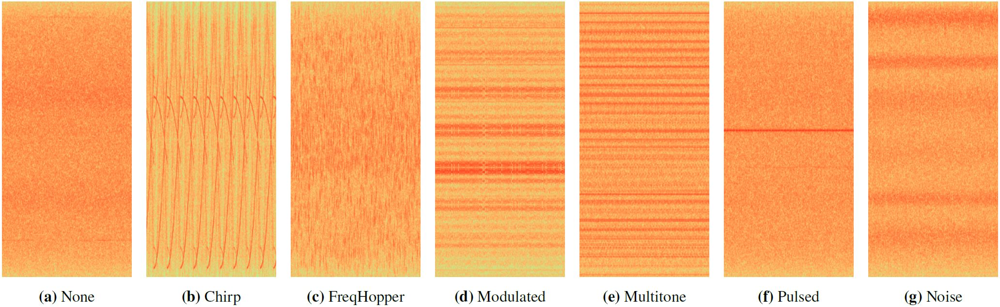

# GNSS Dataset Recorded with a High-frequency Antenna in a Controlled Indoor Environment for Interference Classification

Latest update: 2024-11-13

Project size: 1.9 TB


## Introduction

We publish the *GNSS Spectrum Controlled High-Frequency* dataset that was recorded in a controlled indoor large-scale environment with a high-frequency antenna. The recording was done in the large-scale industrial [Fraunhofer IIS L.I.N.K. test and application center](https://www.iis.fraunhofer.de/en/ff/lv/lok/test/link.html). The dataset contains a variety of interference classes in GNSS signals. 

## Dataset

The folder *GNSS_dataset* contains the dataset with the corresponding labels.


The recording was done in parallel with the recording of the dataset 2 of the GNSS Spectrum controlled low-frequency dataset. See the following website: https://gitlab.cc-asp.fraunhofer.de/darcy_gnss/controlled_low_frequency

The following figure shows exemplary snapshots of the spectrogram:



For our spectrum highway dataset 1 recorded along a highway bridge, see the following website: https://gitlab.cc-asp.fraunhofer.de/darcy_gnss/FIOT_highway

For our spectrum highway dataset 2 recorded along a highway bridge, see the following website: https://gitlab.cc-asp.fraunhofer.de/darcy_gnss/fiot_highway2

For our dataset recorded in a controlled environment with a high-frequency antenna, see the following website: https://gitlab.cc-asp.fraunhofer.de/darcy_gnss/FIOT_LC_laboratory

## References

For more information of the dataset and results, see our publication. If you use our dataset for your research, please consider citing:

```
@inproceedings{heublein_raichur_ion,
  author = {Lucas Heublein and Nisha L. Raichur and Tobias Feigl and Tobias Brieger and Fin Heuer and Lennart Asbach and Alexander Rügamer and Felix Ott},
  title = {{Evaluation of (Un-)Supervised Machine Learning Methods for GNSS Interference Classification with Real-World Data Discrepancies}},
  booktitle = {\href{https://www.ion.org/publications/abstract.cfm?articleID=19887}{Proc. of the Intl. Technical Meeting of the Satellite Division of the Institute of Navigation (ION GNSS+)}},
  pages = {1260--1293},
  month = sep,
  year = 2024,
  address = {Baltimore, MD},
  doi = {10.33012/2024.19887}
}

```

For more information of the low-frequency dataset, see:

```
@inproceedings{heublein_feigl,
  author = {Lucas Heublein and Tobias Feigl and Thorsten Nowak and Alexander Rügamer and Christopher Mutschler and Felix Ott},
  title = {{Evaluating ML Robustness in GNSS Interference Classification, Characterization & Localization}},
  booktitle = {\href{https://arxiv.org/abs/2409.15114}{arXiv preprint arXiv:2409.15114}},
  month = aug,
  year = 2024
}
```


## Acknowledgment

This work has been carried out within the DARCII project, funding code 50NA2401, supported by the German Federal Ministry for Economic Affairs and Climate Action (BMWK), managed by the German Space Agency at DLR and assisted by the Bundesnetzagentur (BNetzA) and the Federal Agency for Cartography and Geodesy (BKG). Additionally, this work was supported by the Bavarian Ministry of Economic Affairs, Regional Development and Energy through the Center for Analytics – Data – Applications (ADA-Center) within the framework of „BAYERN DIGITAL II“ (20-3410-2-9-8).


## License

This work is licensed under a CC BY-NC-SA 4.0: Creative Commons Attribution-Noncommercial-ShareAlike, see [https://creativecommons.org/licenses/by-nc-sa/4.0/]()


## Kontakt

If you have any questions or tips to improve the datasets, contact us:

Felix Ott: [felix.ott@iis.fraunhofer.de]()

Lucas Heublein: [lucas.heublein@iis.fraunhofer.de]()

Nordostpark 84, 90411 Nürnberg, Germany, [GoogleMaps](https://www.google.de/maps/place/Fraunhofer-Institut+f%C3%BCr+Integrierte+Schaltungen+IIS,+Standort+N%C3%BCrnberg/@49.486235,11.1276616,17z/data=!4m13!1m7!3m6!1s0x47a1fd54eca9e61f:0xa0f77e8f8bf3c17d!2sNordostpark+84,+90411+N%C3%BCrnberg!3b1!8m2!3d49.4860832!4d11.1290145!3m4!1s0x47a1fd548f392167:0xbf6afa9178ff23d9!8m2!3d49.4861809!4d11.1286658)

Fraunhofer Institute for Integrated Circuits IIS, Nürnberg, Germany
